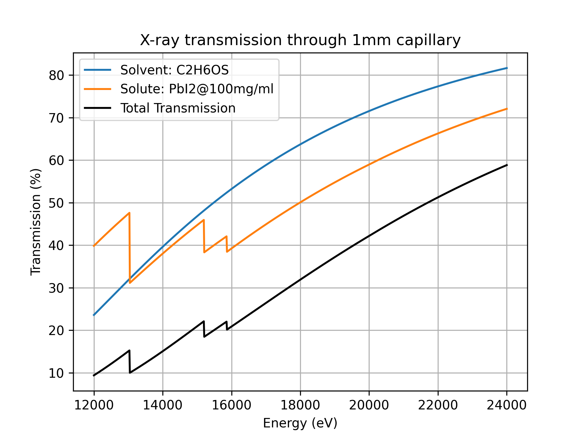

# xraytools

**xraytools** is a Python module I created to assist in my X-ray scattering experiment planning. It includes functions for calculating sample-to-detector distances, scattering vector ranges, critical angles, attenuation coefficients, transmission through materials, and more. I hope you also find it useful.

Here are some example outputs from xraytools: 



## Features

- **Calculate sample-to-detector distance (SDD)** for various detector configurations.
- **Determine Q-range** for different beam positions.
- **Compute critical angles** for total external reflection.
- **Find X-ray absorption edges** for elements.
- **Calculate attenuation coefficients** and **transmission** through various materials and solutions.
- **Calculate X-ray electric field intensity** throughout the film depth for varying incident angles.

## Installation

Clone the repository and import the module into your Python project:

```bash
git clone https://github.com/tchaney97/xraytools.git
```

## Requirements

To use the `xraytools` module, you'll need to have the following prerequisites:

- **Python 3.6+**: The module requires Python 3.6 or higher.
- **NumPy**: For numerical computations.
- **PrettyTable**: For displaying tables in a readable format.
- **Matplotlib** (optional): For plotting data visualizations, if required.
- **xraydb**: For X-ray spectroscopy data.

To install the required packages, you can use the following command:

```bash
pip install numpy PrettyTable matplotlib xraydb
```

## Usage

Import the `xraytools` module and call its functions as needed. Below are examples and short descriptions of each function:

### 1. `calc_sdd`

```python
xraytools.calc_sdd(length_y=100, length_x=100, energy=12000, max_q=2.0)
```

Calculates the sample-to-detector distance (SDD) required to achieve a specified maximum scattering vector (Q) at the edge or corner of the detector for different beam positions.

### 2. `calc_qrange`

```python
xraytools.calc_qrange(length_y=100, length_x=100, bs_radius=5, energy=12000, sdd=500)
```

Determines the range of scattering vectors (Q) accessible given a specific sample-to-detector distance (SDD) and beamstop radius for various beam positions on the detector.

### 3. `calc_critical_angle`

```python
xraytools.calc_critical_angle(energy=12000, stoichiometry='SiO2', density=2.65)
```

Calculates the critical angle for total external reflection for a given material and energy.

### 4. `calc_critical_angle_table`

```python
xraytools.calc_critical_angle_table(energies=[8000, 10000, 12000], stoichiometries=['SiO2', 'Al2O3'], densities=[2.65, 3.95])
```

Generates a table of critical angles for multiple materials and energies.

### 5. `calc_yoneda_material`

```python
xraytools.calc_yoneda_material(incident_deg=0.5, energy=12000, stoichiometry='SiO2', density=2.65)
```

Calculates the Yoneda peak position for a given material and incident angle.

### 6. `calc_yoneda_critical`

```python
xraytools.calc_yoneda_critical(incident_deg=0.5, energy=12000, crit_deg=0.2)
```

Calculates the Yoneda peak position using a specified critical angle.

### 7. `find_xray_edges`

```python
xraytools.find_xray_edges(element='Fe')
```

Finds the X-ray absorption edges for a specified element.

### 8. `calc_mu`

```python
xraytools.calc_mu(energy=12000, stoichiometry='SiO2', density=2.65)
```

Calculates the linear attenuation coefficient (mu) for a material at a specified energy.

### 9. `calc_mu_list`

```python
xraytools.calc_mu_list(energies=[8000, 10000, 12000], stoichiometry='SiO2', density=2.65)
```

Calculates the linear attenuation coefficients (mu) for a material over a range of energies.

### 10. `calc_mu_grid`

```python
xraytools.calc_mu_grid(energies=[8000, 10000, 12000], stoichiometries=['SiO2', 'Al2O3'], densities=[2.65, 3.95])
```

Calculates and displays the attenuation lengths for multiple materials over a range of energies.

### 11. `calc_transmission`

```python
xraytools.calc_transmission(energy=12000, stoichiometry='SiO2', density=2.65, thickness=1)
```

Calculates the transmission of X-rays through a material of specified thickness.

### 12. `calc_transmission_list`

```python
xraytools.calc_transmission_list(energies=[8000, 10000, 12000], stoichiometry='SiO2', density=2.65, thickness=1)
```

Calculates the transmission of X-rays through a material of specified thickness over a range of energies.

### 13. `calc_transmission_grid`

```python
xraytools.calc_transmission_grid(energies=[8000, 10000, 12000], stoichiometries=['SiO2', 'Al2O3'], densities=[2.65, 3.95], thicknesses=[1, 2])
```

Calculates and displays the transmission of X-rays through multiple materials and thicknesses over a range of energies.

### 14. `calc_solution_transmission`

```python
xraytools.calc_solution_transmission(
    energies=[8000, 10000, 12000],
    solvent_stoich='H2O', 
    solvent_dens=1.0, 
    solute_stoich='NaCl', 
    solute_dens=2.165, 
    mg_per_ml=100, 
    cap_diam=1
)
```

Calculates the transmission of X-rays through a solution in a capillary, accounting for both solvent and solute contributions.

### 15. `calc_xefi`

```python
xraytools.calc_xefi(
    energy = 10000, 
    film_stoichiometry = 'C2H4', 
    film_density = 0.9, 
    sub_stoichiometry = 'Si', 
    sub_density = '2.33',
    sampthick = 180, 
    incidentangs = np.linspace(0.05,0.2,500),
    plot=True)
)
```

Calculate the X-ray Electric Field Intensity (XEFI) throughout a thin film's depth. Assumes one material and zero surface roughness. 

## License

This project is licensed under the MIT License. See the [LICENSE](LICENSE) file for details.

---

Feel free to contact me with any questions or suggestions. Happy scattering!
